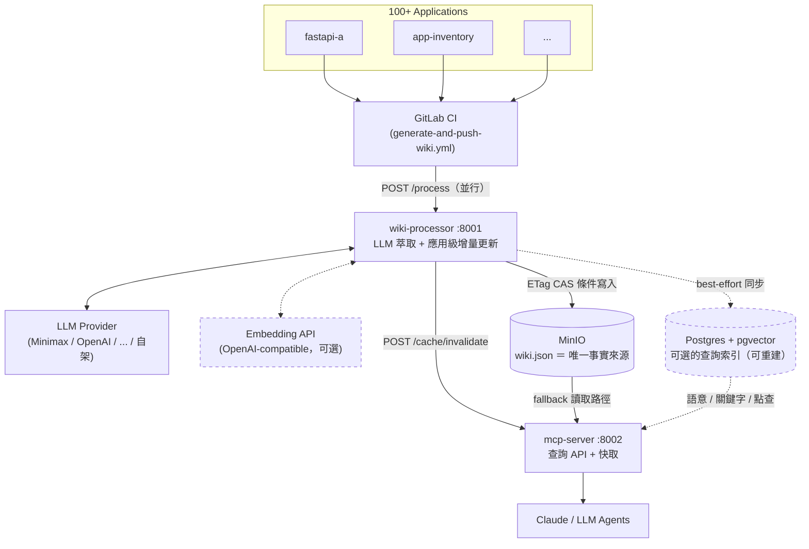
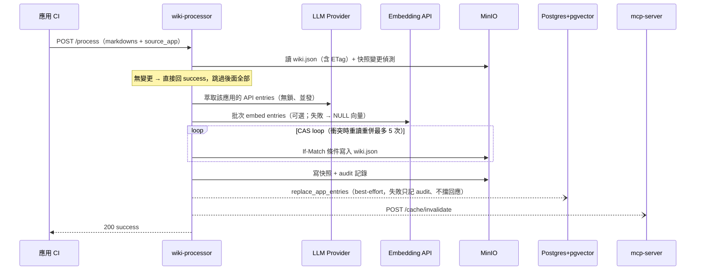
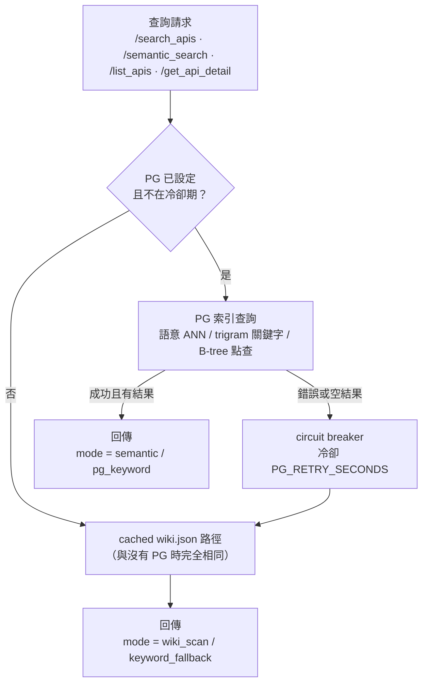

# LLM Wiki MCP

支持 **100+ 應用** 的集中式 Wiki 系統。每個應用獨立生成文檔，直接提交到 wiki-processor，實現準實時、應用隔離的增量更新。

基於 Karpathy 風格知識累積 + MCP 協議，適合團隊共享與 LLM 理解。

## 架構（去中心化 + 直接觸發）



> 虛線 = 可選的向量索引層（`PG_DSN` 未設定時不存在，系統行為不變）。
> MinIO 永遠是事實來源；PG 是衍生索引，掛掉自動 fallback、可隨時
> `POST /admin/reindex` 重建。詳見 [向量檢索架構](docs/architecture/vector-search.md)。

## 核心特性

| 特性 | 說明 |
|------|------|
| **應用級增量更新** | 100 個應用並行更新時，只重新生成該應用的 wiki 檔案，其他應用不受影響 |
| **準實時同步** | markdown 有更新 → CI 觸發 → wiki 1-2 分鐘內更新 |
| **無中央瓶頸** | 應用直接 POST 到 wiki-processor，無需等待 wiki-repo 拉取 |
| **審計日誌** | 所有更新記錄在 wiki-audit-log.jsonl (NDJSON 格式) |
| **智能緩存** | mcp-server 內存緩存 + 應用級別的緩存失效 |
| **統一 CI 模板** | 一份 .gitlab-ci.yml include 就搞定，應用無需修改 |
| **多 LLM 提供商** | 支持 Minimax、OpenAI、Anthropic、Gemini、Groq、Azure、自架 LLM（Ollama/vLLM），透過 `LLM_PROVIDER` 切換 |
| **多副本安全** | wiki 寫入用 MinIO ETag CAS 條件寫入，多實例並發不丟更新 |
| **語意搜尋（可選）** | Postgres + pgvector 索引：`/semantic_search` ANN 檢索含相似度分數；30k entries 下關鍵字搜尋 17×、冷快取 32× 加速；PG 掛掉自動 fallback 回 MinIO 路徑 |

## 快速開始

### 1. 環境準備

```bash
# 複製環境變數
cp .env-example .env

# 編輯 .env，填入你選用的 LLM provider API key
nano .env
```

`.env` 必要變數：

```env
LLM_PROVIDER=minimax         # 預設；可換成 openai / anthropic / gemini / groq / azure / openai-compatible
LLM_API_KEY=your-key-here    # 舊的 MINIMAX_API_KEY 仍向後相容
MINIO_ROOT_USER=minioadmin
MINIO_ROOT_PASSWORD=minioadmin
```

### 2. 啟動服務

```bash
docker-compose up -d

# 檢查服務狀態
docker-compose ps
```

服務列表：
- **Minio 控制台**：http://localhost:9001 (user: minioadmin, pass: minioadmin)
- **wiki-processor API**：http://localhost:8001
- **mcp-server API**：http://localhost:8002

### 3. 測試服務

```bash
# 健康檢查
curl http://localhost:8001/health
curl http://localhost:8002/health

# 查詢 wiki 狀態
curl http://localhost:8001/status
curl http://localhost:8002/wiki_info
```

## 使用流程（應用端）

### 第一步：設置應用的 CI

在你的應用（如 fastapi-a）中，添加 `.gitlab-ci.yml`：

```yaml
# .gitlab-ci.yml
include:
  - remote: 'https://gitlab.com/t.tienyulin/ci-scripts/raw/master/templates/generate-and-push-wiki.yml'

# 其他配置...
```

### 第二步：實現文檔生成

創建 `scripts/generate_docs.py`，生成 markdown 文件到 `docs/` 目錄：

```python
# scripts/generate_docs.py
import os
from datetime import datetime

def generate_api_markdown(app_name: str) -> dict[str, str]:
    """生成你的應用的 API 文檔"""
    return {
        "api.md": f"""---
title: "{app_name} API"
type: "api_module"
module: "{app_name}"
source_app: "{app_name}"
description: "..."
endpoints: [...]
---
# API Docs
..."""
    }

if __name__ == "__main__":
    app_name = "your-app-name"
    markdowns = generate_api_markdown(app_name)
    os.makedirs("docs", exist_ok=True)
    for name, content in markdowns.items():
        with open(f"docs/{name}", "w") as f:
            f.write(content)
```

### 第三步：推送更新

```bash
git add scripts/generate_docs.py docs/
git commit -m "docs: update api documentation"
git push

# GitLab CI 自動觸發：
# 1. 執行 generate_docs.py
# 2. 蒐集 docs/ 中的 markdown
# 3. POST 到 wiki-processor
# 4. wiki-processor 執行應用級更新
```

## 核心 API 端點

### wiki-processor (8001)

```bash
# 提交 markdown 更新（直接由應用 CI 調用）
POST /process
  request: {
    "markdowns": {"api.md": "..."},
    "timestamp": "2026-05-10T...",
    "source_app": "app-inventory",        # 應用名稱
    "source_version": "abc1234"           # git commit SHA
  }
  response: {
    "status": "success",
    "files_updated": ["api/app-inventory.md"],
    "processing_time_ms": 1250,
    "source_app": "app-inventory"
  }

# 查詢狀態
GET /status
  response: {
    "status": "running",
    "wiki_size": 42,
    "tracked_files": 15,
    "last_updated": "2026-05-10T..."
  }

# 健康檢查
GET /health
```

### mcp-server (8002)

```bash
# 查詢 wiki 統計
curl http://localhost:8002/wiki_info

# 關鍵字搜尋（PG 啟用時回 mode=pg_keyword，否則 mode=wiki_scan）
curl "http://localhost:8002/search_apis?query=inventory"

# 語意搜尋（需啟用 PG+pgvector；不可用時自動降級為關鍵字）
curl "http://localhost:8002/semantic_search?query=inventory%20health&top_k=5"

# 列出 API
curl "http://localhost:8002/list_apis"

# 緩存失效（由 wiki-processor 調用）
POST /cache/invalidate
  request: {"source_app": "app-inventory"}
  response: {"status": "ok", "invalidated_entries": 5}
```

## Minio Wiki 結構（schema v2）

```
wiki-data/
├── wiki.json                      # 唯一事實來源：{schema_version: 2, apis: {module: {api_key: {...}}}}
│                                  # 每個 entry 帶 processor 蓋章的 source_app / source_version
├── snapshots/
│   └── {app}.json                 # 各應用上次提交的 markdown 快照（變更偵測用）
├── markdowns_snapshot.json        # 全量提交（無 source_app）的快照
└── audit/
    └── {iso-ts}-{uuid8}.json      # append-only 審計記錄，每次提交一筆
```

啟用 PG 後另有衍生索引表 `api_entries`（每個 API entry 一列 + 向量），
可隨時從 wiki.json 重建，見 [db/README.md](db/README.md)。

## 應用隔離驗證

```bash
# 壓力測試：100 個應用並行更新（hermetic，無需服務）
python tests/stress/test_mock_stress.py

# 真實服務壓測（需先啟動服務；PG 啟用時自動驗證索引完整性）
python tests/stress/test_real_service_stress.py

# 預期結果：
# ✓ 100/100 提交成功、無 lost update（CAS 驗證）
# ✓ 應用隔離：重新提交只取代該應用的 entries
# ✓ 審計記錄完整（每提交一筆）
# ✓ （PG 啟用時）索引完整 + 語意抽樣可命中
```

## CI/CD 統一配置

所有應用使用相同的 CI 模板（無需修改）：

```yaml
# ci-scripts/templates/generate-and-push-wiki.yml

stages:
  - generate    # 執行 scripts/generate_docs.py
  - push        # 發送到 wiki-processor

generate_docs:
  # 自動執行應用的 generate_docs.py
  # 驗證 docs/ 目錄生成成功

push_wiki:
  # 蒐集所有 markdown
  # POST 到 $WIKI_PROCESSOR_URL/process
  # 附帶 source_app 和 source_version
```

## 環境變數

```env
# LLM 提供商設定（擇一，詳見 .env-example）
LLM_PROVIDER=minimax           # minimax / openai / anthropic / gemini / groq / azure / openai-compatible
LLM_API_KEY=your-key-here      # API 金鑰（舊的 MINIMAX_API_KEY 仍可作為備援）
LLM_MODEL=MiniMax-M2.7         # 各提供商的預設模型見 .env-example
# LLM_BASE_URL=                # 僅 openai-compatible（Ollama/vLLM/LM Studio）需要

# Minio 存儲
MINIO_ENDPOINT=minio:9000
MINIO_ACCESS_KEY=minioadmin
MINIO_SECRET_KEY=minioadmin
MINIO_BUCKET=wiki-data
MINIO_SECURE=false

# 本地測試時使用
MOCK_LLM=true                  # 模擬 LLM，不呼叫真實 API
```

> 完整的 7 種提供商配置範例（OpenAI、Anthropic、Gemini、Groq、Azure、Ollama 等）請見 [`.env-example`](.env-example)。

## GitLab 配置

已為你準備好的 repos：

| Repo | 分支 | 內容 |
|------|------|------|
| **ci-scripts** | master | ✅ 通用 CI 模板 (templates/generate-and-push-wiki.yml) |
| **fastapi-a** | master | ✅ .gitlab-ci.yml + scripts/generate_docs.py |
| **fastapi-b** | master | ✅ .gitlab-ci.yml + scripts/generate_docs.py |
| **wiki-repo** | master | ✅ 簡化為狀態監控（應用直接 POST） |

所有改動已 **merge** 到 master，無需額外設置。

## 測試與驗證

```bash
# 單元測試
cd wiki-processor && pytest tests/ -v
cd ../mcp-server && pytest tests/ -v

# 壓力測試（100 應用並行更新）
python tests/stress/test_mock_stress.py

# 手動測試
curl -X POST http://localhost:8001/process \
  -H "Content-Type: application/json" \
  -d '{
    "markdowns": {"test.md": "---\ntitle: Test\n---\n# Test"},
    "timestamp": "2026-05-10T00:00:00Z",
    "source_app": "test-app",
    "source_version": "v1.0.0"
  }'
```

## 部署到 Kubernetes

POC 已準備好，下一步可擴展到 k8s：

```yaml
# wiki-processor Deployment
apiVersion: apps/v1
kind: Deployment
metadata:
  name: wiki-processor
spec:
  replicas: 3  # 多實例處理並發
  containers:
  - name: wiki-processor
    image: wiki-processor:3.14
    ports:
    - containerPort: 8001
    env:
    - name: LLM_PROVIDER
      value: minimax
    - name: LLM_API_KEY
      valueFrom:
        secretKeyRef:
          name: wiki-secrets
          key: llm-api-key

# mcp-server Deployment
apiVersion: apps/v1
kind: Deployment
metadata:
  name: mcp-server
spec:
  replicas: 2
  containers:
  - name: mcp-server
    image: mcp-server:3.14
    ports:
    - containerPort: 8002
```

## 故障排除

| 問題 | 解決 |
|------|------|
| `POST /process` 返回 null | 檢查 `LLM_API_KEY` 是否正確；或使用 `MOCK_LLM=true` 測試 |
| Minio 連線失敗 | 確認 `docker-compose ps` 中 minio 運行；或檢查 MINIO_ENDPOINT |
| wiki-processor 超時 | 增大 `timeout` 參數；檢查 LLM API 響應時間 |
| mcp-server 返回空 wiki | 先執行 `/process` endpoint 生成 wiki.json |

## 📚 文檔

完整文檔請參考 [docs/README.md](docs/README.md)

> 📖 **第一次接觸這個專案？** 先看 [端到端完整範例](docs/guides/end-to-end-example.md)
> —— 用真實跑過的資料走完整條 pipeline：兩份 markdown 經過每一步變成什麼、
> MinIO / Postgres 各存了什麼、查詢時用什麼撈到什麼。

**常用連結：**
- [本地設置指南](docs/guides/local-setup.md) — 環境配置和快速開始
- [開發指南](docs/guides/development.md) — 代碼結構和擴展
- [GitLab CI 集成](docs/guides/gitlab-setup.md) — CI/CD 配置步驟
- [LLM 提供商架構](docs/architecture/llm-provider-abstraction.md) — 多提供商設計
- [向量檢索架構](docs/architecture/vector-search.md) — PG+pgvector 設計與實測評估
- [並發模型](docs/architecture/concurrency.md) — 多副本 CAS 寫入設計
- [API 文檔](docs/api/schema.md) — 完整 API 端點參考
- [故障排除](docs/troubleshooting.md) — 常見問題和解決方案

**測試文檔：**
- [測試指南](tests/README.md) — 如何運行測試、組織結構
- 單元測試：`wiki-processor/tests/` 和 `mcp-server/tests/`
- 集成測試：`tests/integration/`
- 壓力測試：`tests/stress/`

## 架構圖

### 寫入流程（一次 /process 提交）



### 讀取流程（mcp-server 每個查詢端點）



> 設計重點：**降級永遠可用**——PG 不存在、剛清空、或中途掛掉，
> 查詢都自動落回原本的 MinIO 快取路徑，不回 5xx。

### 組件責任

| 組件 | 責任 |
|------|------|
| **wiki-processor** | 接收 markdown、LLM 處理、應用級 CAS 更新、Minio 存儲、PG 索引同步 |
| **mcp-server** | 緩存、HTTP 查詢（PG-first + 自動 fallback）、語意搜尋 |
| **Minio** | 持久化存儲（唯一事實來源）、審計日誌 |
| **Postgres + pgvector**（可選） | 衍生查詢索引：ANN 語意搜尋、trigram 關鍵字、點查；可隨時重建 |
| **CI 模板** | 統一應用端的文檔生成和提交流程 |

## 下一步

1. ✅ Schema v2 + 多副本 CAS 並發 + 認證 + 限速
2. ✅ 多 LLM 提供商抽象
3. ✅ 向量檢索層（PG + pgvector：語意搜尋 + 查詢加速）
4. ⏳ 大規模壓測（100+ 應用、1000+ 並發 agents）
5. ⏳ CI/CD 自動文檔生成集成
6. ⏳ k8s 部署與監控
