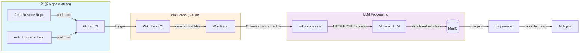
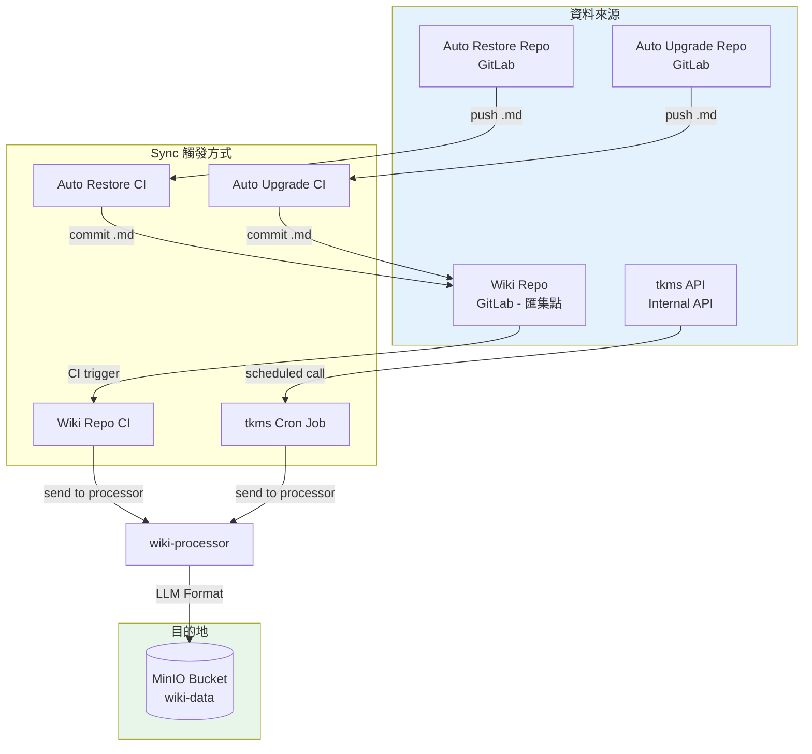
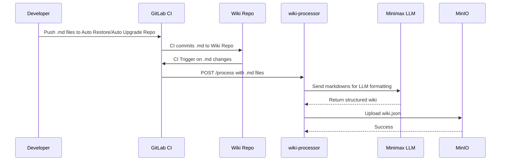
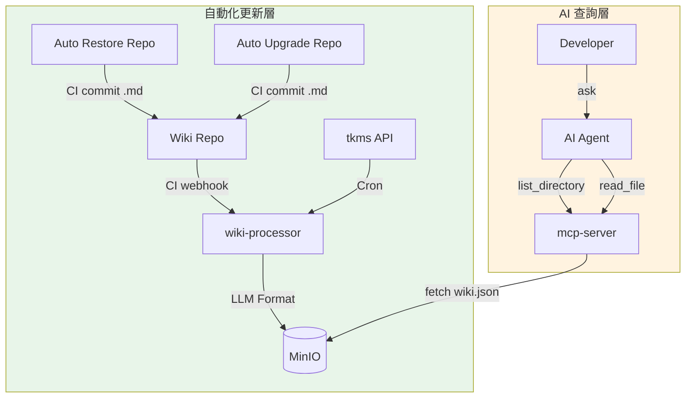
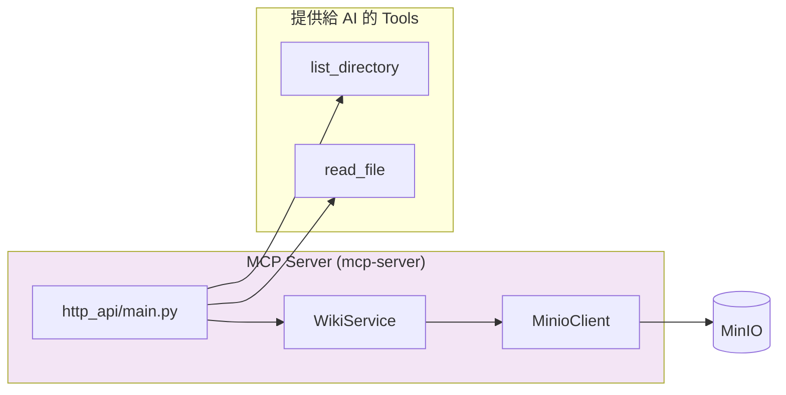

# GitLab 整合指南：LLM Wiki 自動化知識攝取

**Status:** Draft
**Branch:** `docs/gitlab-integration`

---

## Overview

本文件說明如何將外部 GitLab Repo 的 Markdown 文件自動化攝取到 LLM Wiki 知識庫。

### 核心流程



---

## 資料來源架構

### 4 個資料來源 → Wiki Repo → MinIO



### Sync 類型比較

| Sync 類型 | 觸發方式 | 資料來源 | 用途 |
|-----------|---------|---------|------|
| **Wiki Sync** | Wiki Repo CI commit | Auto Restore / Auto Upgrade Repo | 格式化 md → LLM → MinIO |
| **tkms Sync** | Cron (定時) | tkms API | Call API → LLM 整理 → MinIO |

---

## Wiki Repo CI 設置

### GitLab CI Pipeline 流程



### `.gitlab-ci.yml` 範例

```yaml
stages:
  - deploy

update-wiki:
  stage: deploy
  image: python:3.11-slim
  rules:
    - changes:
        - "**/*.md"
  variables:
    WIKI_PROCESSOR_URL: "${WIKI_PROCESSOR_URL:-http://wiki-processor:8001}"
    MARKDOWN_PATTERN: "**/*.md"
  script:
    - pip install httpx
    - |
      python3 << 'EOF'
      import os
      import glob
      import httpx
      import json

      pattern = os.environ.get("MARKDOWN_PATTERN", "**/*.md")
      processor_url = os.environ.get("WIKI_PROCESSOR_URL", "http://wiki-processor:8001")
      
      files = {}
      for path in glob.glob(pattern, recursive=True):
          if path.startswith('.'):
              continue
          files[path] = open(path).read()
      
      if not files:
          print("No markdown files found")
          exit(0)
      
      print(f"Collected {len(files)} markdown files")
      
      with httpx.Client(timeout=300) as client:
          resp = client.post(f"{processor_url}/process", json=files)
          print(f"Response: {resp.status_code} - {resp.text}")
      EOF
```

---

## wiki-processor API

### Endpoint: `POST /process`

接收 Markdown 文件，經 LLM 格式化後存到 MinIO。

**Request:**
```json
{
  "markdowns/auto-restore/api-users.md": "# API Users\n\n## GET /users\n\n...",
  "markdowns/auto-upgrade/api-orders.md": "# Orders API\n\n## POST /orders\n\n..."
}
```

**Response:**
```json
{
  "status": "success",
  "message": "Wiki updated successfully",
  "files_processed": 3,
  "changes": {
    "modified": ["api/users.md"],
    "created": ["api/orders.md"]
  }
}
```

---

## 完整請求流動路徑



---

## MinIO 儲存結構

```
wiki-data bucket (S3-compatible)
└── wiki.json          # 合併的 wiki 資料（Karpathy 格式）
```

wiki.json 結構：

```json
{
  "overview.md": {
    "title": "Project Overview",
    "content": "# Project Overview\n\n...",
    "frontmatter": {...}
  },
  "api/users.md": {
    "title": "Users API",
    "content": "...",
    "frontmatter": {...}
  }
}
```

---

## 環境變數

| 變數名 | 預設值 | 說明 |
|--------|-------|------|
| `MINIO_ENDPOINT` | `minio:9000` | MinIO 位置 |
| `MINIO_ACCESS_KEY` | `minioadmin` | MinIO Access Key |
| `MINIO_SECRET_KEY` | `minioadmin` | MinIO Secret Key |
| `MINIO_BUCKET` | `wiki-data` | Bucket 名稱 |
| `MINIMAX_API_KEY` | - | Minimax API Key (wiki-processor 需要) |
| `WIKI_PROCESSOR_URL` | `http://wiki-processor:8001` | Processor URL (CI 環境) |

---

## 與 MCP Server 的關係



| 元件 | 職責 |
|------|------|
| mcp-server | 從 MinIO 讀取 wiki.json，提供 list_directory / read_file 工具給 AI Agent |
| wiki-processor | 接收外部 Markdown，經 LLM 格式化後寫入 MinIO |
| MinIO | S3 儲存，存放 wiki.json |

---

## 與 Karpathy Wiki 的差異

本系統參考 [Karpathy's wiki](https://github.com/karpathy/llm-wiki) 概念，但實作細節不同：

| 特色 | Karpathy Wiki | 本系統 |
|------|--------------|--------|
| 儲存格式 | 多個離散 .md 檔案 | MinIO 單一 wiki.json |
| 觸發方式 | 手動或排程 | GitLab CI webhook |
| 資料來源 | 本地檔案 | 外部 GitLab Repos + tkms API |
| LLM 整合 | 直接呼叫 | wiki-processor 包裝 |

---

## 實作狀態

| 元件 | 狀態 |
|------|------|
| Wiki Repo | ✅ 需要建立 |
| Wiki Repo CI | ✅ 範例已提供 |
| wiki-processor | ✅ 已實作 |
| MinIO | ✅ 已架設 |
| mcp-server | ✅ 已實作 |
| tkms Sync | ⏳ 待實作 |
| Keycloak | ⏳ 待實作 |

---

## 快速開始

### 1. 建立 Wiki Repo (GitLab)

```bash
# 在 GitLab 建立一個空 repo
# 例如: gitlab.com/your-org/wiki-repo
```

### 2. 設定 GitLab CI

將 `.gitlab-ci.yml` 放到 Auto Restore / Auto Upgrade Repo 根目錄。

### 3. 確認 wiki-processor 運行

```bash
docker compose up -d wiki-processor
```

### 4. 測試

```bash
# 在 Auto Restore Repo 中修改 .md 文件並 push
# 觀察 GitLab CI Pipeline 執行
# 檢查 MinIO wiki.json 是否更新
```

---

## 延伸閱讀

- [GITLAB_SETUP.md](./GITLAB_SETUP.md) - GitLab CI 詳細設置
- [IMPLEMENTATION_GUIDE.md](./IMPLEMENTATION_GUIDE.md) - LLM Wiki 系統設計
- [README.md](./README.md) - 專案概覽