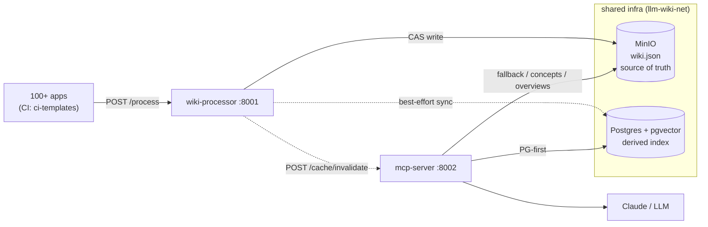
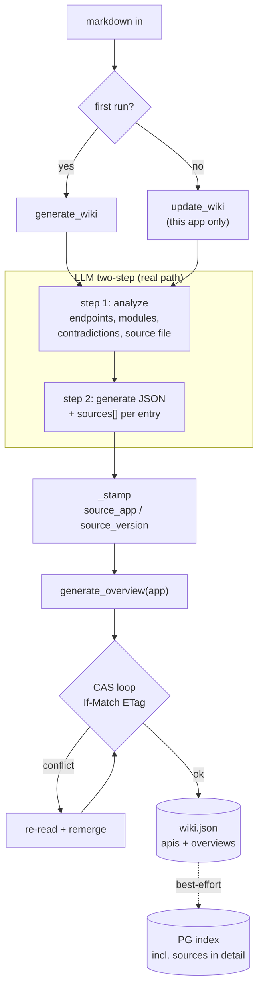
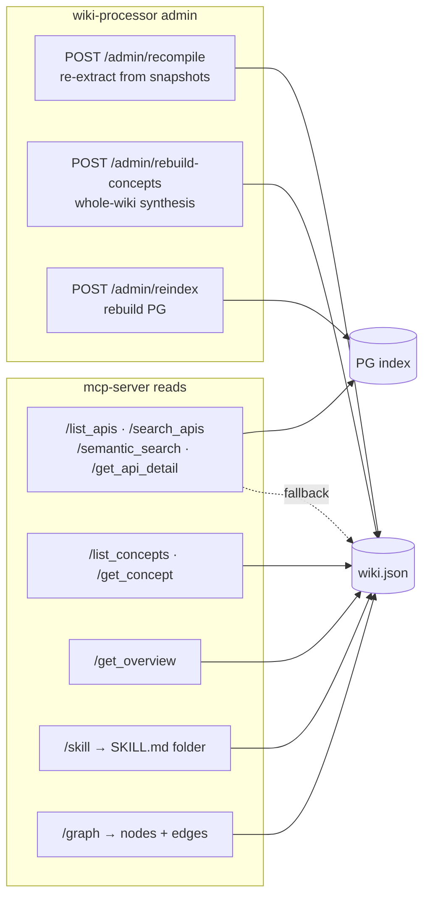
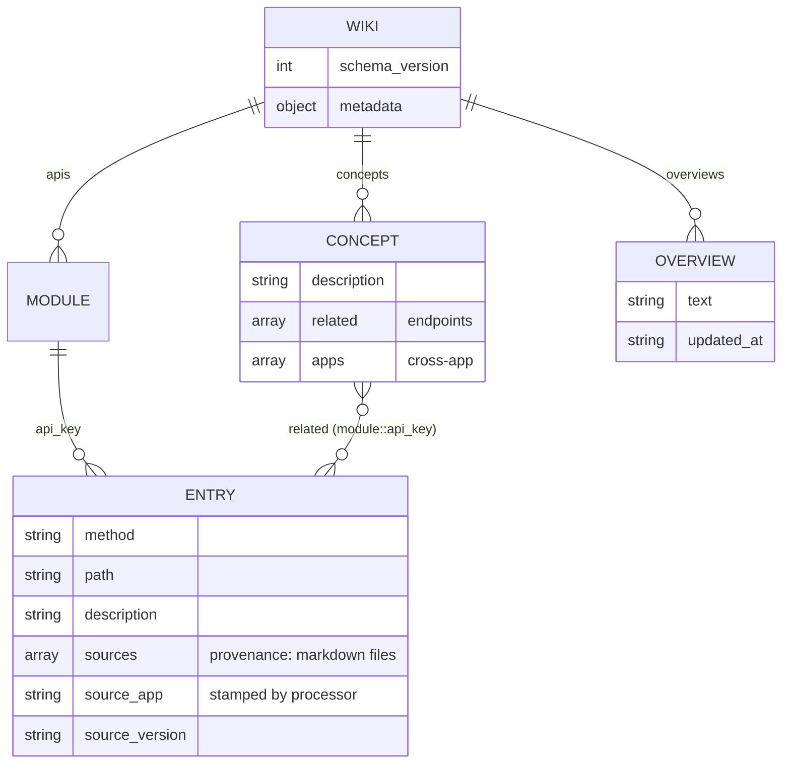
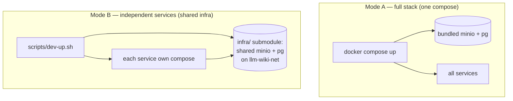

# Architecture diagrams

Cross-service views of the platform. Per-service internals live in each repo's
`docs/architecture/`.

## System overview

## Ingest pipeline (`/process`, two-step + CAS)

Concepts are **not** built here — they're synthesized whole-wiki via
`POST /admin/rebuild-concepts`, not per-push (a per-push full-wiki LLM scan +
shared-blob write would mean cost + CAS contention on every app submission).

## Query + admin surfaces

## wiki.json data model

Graph edges (`GET /graph`): `shared_source` weight 4.0 (entries sharing a source
file), `concept` weight 3.0 (concept→entry). Adamic-Adar / Louvain communities
are a marked upgrade path.

## Run modes

Run one mode at a time — both bind host ports 9000/9001/5432.
