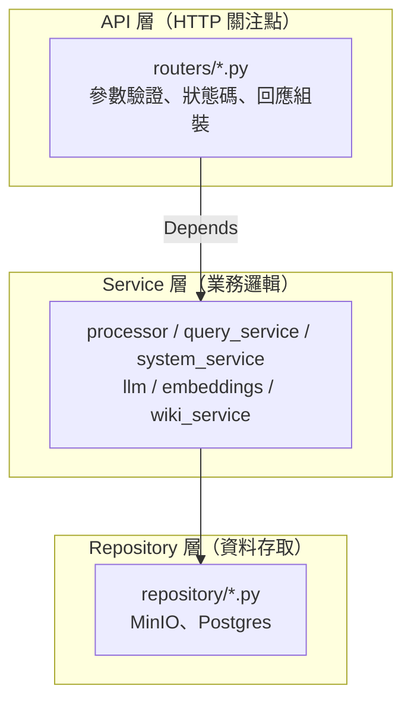

# 三層式服務架構（api / service / repository）

兩個 FastAPI 服務（wiki-processor、mcp-server）統一採三層架構。
本文件描述各層責任、依賴注入方式與測試模式。

## 分層原則



- **API 層只做 HTTP**：驗證 query/body、clamp 參數、raise 4xx、組 response dict。不直接碰 repository。
- **Service 層擁有業務規則**：pipeline 編排、PG-first fallback 契約、health/status 組裝。
- **Repository 層擁有外部系統**：MinIO 讀寫（CAS）、PG 讀寫（circuit breaker）。目錄名 `repository/`。

## wiki-processor

```
main.py                  create_app() + lifespan warm-up（boot 時 fail-fast）
core/config.py           Settings dataclass + get_settings()（組合 llm/embeddings 既有 loader）
core/deps.py             lru_cache(1) providers：get_storage/get_llm/get_embedder/
                         get_vector_store/get_processor + reset_singletons()
api/dependencies.py      require_api_key（request 時讀 PROCESSOR_API_KEY）
api/routers/process.py   POST /process
api/routers/admin.py     POST /admin/reindex
api/routers/system.py    GET /status、GET /health（邏輯在 services/system_service.py）
services/processor.py    pipeline 編排（兩階段 CAS 寫入，不變）
services/system_service.py  status/health 組裝；用 MinioStorage.ping() 不碰 client 內部
repository/minio_client.py  MinIO CAS 讀寫
repository/pg_store.py      PG 寫入端；擁有 DDL（ensure_schema）
```

**依賴注入**：providers 是 lazy lru_cache singleton——測試的 `TestClient(app)` 不跑
lifespan，所以 import 時禁止碰網路。production 的 fail-fast 由 lifespan 呼叫一次
`get_processor()` 保住：設定錯誤在 boot 時就死，不是第一個 request。

## mcp-server

```
http_api/main.py             create_app() factory + lifespan（資源掛 app.state）
http_api/deps.py             get_query_service/get_cache（從 app.state 組裝）
http_api/schemas.py          request/response models
http_api/routers/health.py   GET /health
http_api/routers/query.py    /list_apis /search_apis /semantic_search /get_api_detail /wiki_info
http_api/routers/cache.py    POST /cache/invalidate
core/cache.py                WikiCache（TTL + app 級失效，segment 精確比對）
services/query_service.py    QueryService：PG-first fallback 契約唯一住所
services/wiki_service.py     wiki dict 上的純查詢
services/embeddings.py       query 端 embedder（與 processor 端 golden-pinned，同改）
repository/minio_client.py   MinioReader
repository/pg_reader.py      PGReader + circuit breaker（30s cooldown）
```

**QueryService fallback 契約**（原本散在 4 個端點的重複邏輯）：
PG 是可選加速器——任何錯誤或空結果都退回 cached-wiki 路徑，所以未設定、
掛掉、或尚未建索引的 PG 退化成與沒有 PG 時完全相同的行為。processor 會在
POST /cache/invalidate 之前先同步 PG，所以 fallback cache 被丟棄時 PG 已是
新資料——讀取永不倒退。

`get_api_detail` 的微妙語意：只在 PG 回 `None` 時 fallback；truthy dict
直接採用（PG 的 detail 與 wiki.json 同源）。

**資源生命週期**：`wiki_reader`/`pg_reader`/`query_embedder` 在 lifespan 建立、
掛 `app.state`；`wiki_cache` 在 `create_app()` 時掛上，讓不跑 lifespan 的
TestClient 也有初始化的 state。

## 測試模式

**wiki-processor**：用 `app.dependency_overrides[deps.get_storage] = lambda: mock`
注入 mock；conftest 的 autouse fixture 每個測試前後清 overrides 並
`reset_singletons()`。

**mcp-server**：直接換 `app.state.wiki_reader` / `app.state.pg_reader` /
`app.state.query_embedder`，測試結束還原為 `None`（lifespan shutdown 只對
真 reader 呼叫 aclose）。

## 新增端點流程

1. service 層加方法（業務邏輯、fallback 決策）
2. 對應 router 加 handler（只做 HTTP）；新 router 記得在 `create_app()` include
3. 測試用上面的注入模式
4. 更新 `docs/api/schema.md` 與本文件
