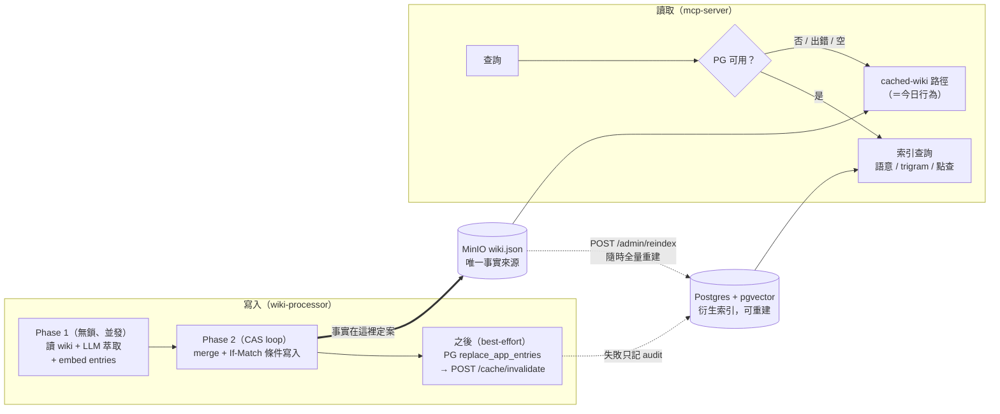
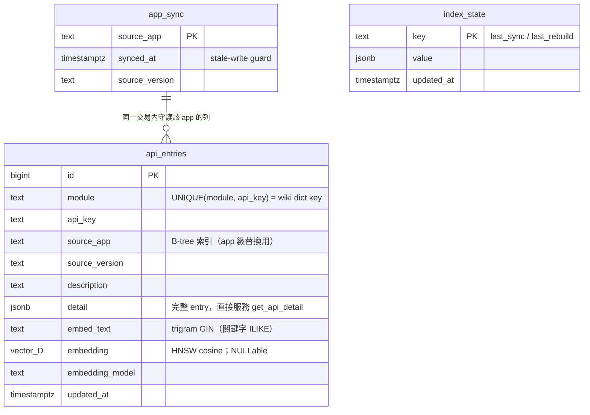
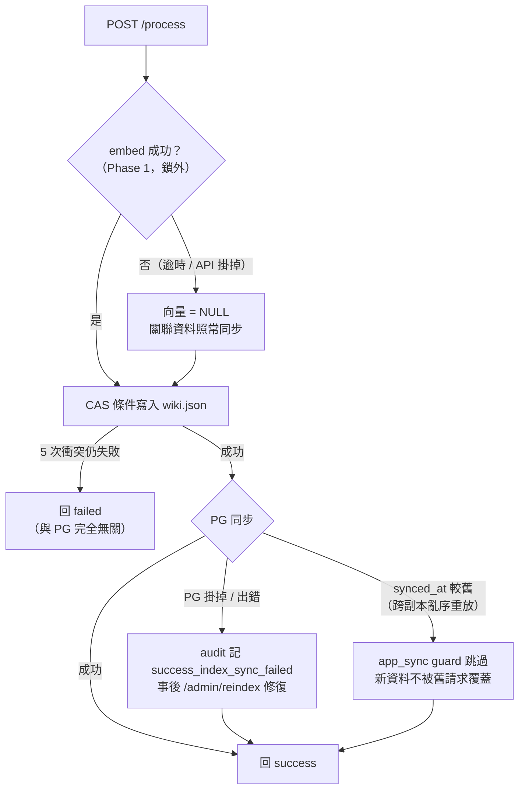

# Vector Search Layer (Postgres + pgvector)

評估報告 + 架構設計：向量資料庫（PostgreSQL + pgvector）如何加速本專案的
資料儲存與查詢 pipeline。所有數字皆為實測（環境：單機沙盒、MOCK_LLM +
MOCK_EMBEDDINGS、本機 MinIO 與 PostgreSQL 16 + pgvector 0.6/HNSW）。

> 想先看具體資料長什麼樣子（markdown 進去、每一步出來什麼、兩邊各存什麼、
> 查詢撈到什麼），請先讀
> [端到端完整範例](../guides/end-to-end-example.md)。

## TL;DR

| 面向 | 沒有 PG（現狀） | 有 PG | 結論 |
|---|---|---|---|
| 關鍵字搜尋 @30k entries（warm cache） | 52.6 ms | **3.1 ms**（trigram GIN） | **17×** |
| 關鍵字搜尋 @30k entries（cold cache） | 195 ms（抓 8 MB + parse + 掃描） | **6.0 ms** | **32×** |
| 語意搜尋 @30k entries | 無此能力（多詞查詢子字串比對直接落空） | **4.1 ms**，ANN top-k 含分數 | 新能力 |
| 點查 get_api_detail | 1.0 ms（warm）/ ~190 ms（cold） | 2.1 ms（恆定） | cache miss 不再懲罰 |
| 每 replica 記憶體 | 整份 wiki 常駐（8 MB @30k，隨資料線性成長） | 近常數 | 水平擴展友善 |
| 寫入額外成本（100 並發 burst） | — | +12%（5.28 s → 5.91 s），每 app ≈ 5.5 ms | 可忽略 |
| 30k entries 全量重建 | — | 94 s（bulk insert + 索引重建一次） | bootstrap 可行 |

## 角色定位：衍生、可重建的 serving index

MinIO 的 `wiki.json` **維持唯一事實來源**——PR #32 的 ETag-CAS 寫入
pipeline 完全不變。Postgres 是衍生出來的查詢索引：

不選「全面遷移到 PG」：會丟掉剛驗證完的 CAS 多副本寫入語意，為讀取優化
承擔分散式寫入重設計的風險。不選「只加語意搜尋的 sidecar」：list/detail/
keyword 仍是 O(整份 wiki 載入)，「資料量大查 MinIO 慢」的核心痛點沒解。
中間路線讓 PG 掛掉時系統退回今日行為，而 PG 資料永遠可以
`POST /admin/reindex` 從 wiki.json 重建——漂移是可修復的，不是致命的。

## Schema

一份可執行的 DDL 活在 `wiki-processor/storage/pg_store.py::ensure_schema()`
（冪等、開機自跑、dim 不符即拒絕），`db/init/01-extension.sql` 只負責
首次開機建 `vector` + `pg_trgm` extension（需 superuser）。

- `api_entries` — 每個 API entry 一列：`module`, `api_key`（UNIQUE 對應
  wiki dict key）、`detail` JSONB（直接服務 get_api_detail）、`embed_text`、
  `embedding vector(D)`（**NULLable**：embeddings 服務掛掉時仍同步關聯資料）、
  `embedding_model`、`source_app`/`source_version`（出處）。
- 索引：HNSW (`vector_cosine_ops`) 做 ANN；trigram GIN on `embed_text` 讓
  `ILIKE '%term%'` 走索引（`embed_text` 串接 module | api_key | endpoint |
  description | params，一欄涵蓋舊掃描的整個 haystack）；B-tree on
  `source_app`/`module`。
- `app_sync` — stale-write guard：交易內 `synced_at` 比較，舊請求（CAS
  競賽輸家、跨副本亂序重放）無法覆蓋新資料。
- `index_state` — last_sync / last_rebuild，由 `/wiki_info` 曝露給監控。

HNSW 而非 IVFFlat：索引從空表逐 app 成長，IVFFlat 需要代表性資料先訓練
lists；HNSW 增量建構、無需調參，在 10²–10⁵ entries 規模 recall/延遲全面
較優。

## 寫入路徑成本（實測）

- 單筆 `replace_app_entries` 交易：**≈ 5.5 ms**（`synchronous_commit=off`
  ——索引可重建，跳過 WAL fsync 是安全的 ~10× 延遲優化）。
- 100 app 並發 burst：5.28 s → 5.91 s（**+12%**），p50 2605→2926 ms、
  p95 4934→5517 ms（p50/p95 高是 burst 排隊效應，兩種模式同受 CAS
  serialization 主導）。索引完整性 100/100，語意抽樣 5/5 可命中。
- Embedding 在 Phase 1（鎖外、與 LLM 同段並發）執行；真實 API 一次批次
  HTTP call（`EMBEDDING_BATCH_SIZE=64`），逾時/失敗降級為 NULL 向量並照常
  同步關聯資料，audit 記 `success_index_sync_failed`。**wiki 寫入永不因
  索引失敗而失敗。**

## 查詢路徑（實測，N=300 / 3 000 / 30 000）

| endpoint（warm cache, p50） | N=300 | N=3 000 | N=30 000 |
|---|---|---|---|
| `/search_apis` wiki 掃描 | 1.5 ms | 5.9 ms | 52.6 ms（線性惡化） |
| `/search_apis` PG trigram | 3.1 ms | 8.1 ms* | **3.1 ms**（平坦） |
| `/semantic_search` PG ANN | 4.3 ms | 2.9 ms | **4.1 ms**（平坦） |
| `/get_api_detail` PG 點查 | 1.9 ms | 1.8 ms | 2.1 ms |
| cold-cache `/search_apis` wiki | 7.7 ms | 18.7 ms | **195 ms** |
| cold-cache `/search_apis` PG | 8.9 ms | 13.4 ms | **6.0 ms** |

\* 小表時 planner 偏好 seq scan（索引本身 0.3 ms）；30k 起自動改走 GIN。

交叉點約在幾千 entries：小規模時記憶體掃描贏 1–2 ms，大規模時 PG 平坦、
wiki 路徑線性惡化且每次 cache miss 付 8 MB 抓取+解析。唯一 PG 較慢的
case：`/list_apis` 無過濾全量列表 @30k（83 ms vs 38 ms，回應本身就是
O(n) 序列化，屬罕用操作，保留 PG-first 以維持語意一致）。

語意搜尋的質性差異：多詞查詢（如 "fetch resource status"）在子字串比對
下零命中，ANN 回 top-k 含 cosine 分數。

## 失敗語意與維運

一次提交中每個可能失敗的環節與其結果（核心不變量：**wiki 寫入永不因
索引層失敗而失敗**）：

- **PG 掛掉**：mcp-server circuit breaker（`PG_RETRY_SECONDS`，預設 30s）
  跳開後直接走 fallback，不會每請求都付 connect timeout；processor 端
  sync 失敗記 audit 後繼續。**兩端皆無 PG 時 = 今日行為**（`PG_DSN` 空
  即停用，比照 `PROCESSOR_API_KEY` dev mode）。
- **漂移**（PG 停機期間有提交）：audit 旗標 + `/wiki_info.vector_index.
  last_sync` 對照 wiki `metadata.updated_at` 可觀測；`POST /admin/reindex`
  修復；`app_sync` guard 防跨副本亂序。
- **拓撲**：compose profile `pg` = 單一 `pgvector/pgvector:pg16` 實例。
  索引可選且可重建，單實例的耐久性是可接受的：PG 死掉讀取自動 fallback，
  恢復後 `/admin/reindex` 重建即可。客戶端（psycopg3）已支援多主機
  failover DSN（`host=a,b,c` + `target_session_attrs=read-write`，
  `test_pg_store.py::test_multihost_dsn_skips_dead_host` 驗證），未來升級
  HA 叢集（repmgr/Patroni/CloudNativePG/管理式 PG）只動 compose 與
  `PG_DSN`，應用程式碼零修改。
- **換 embedding 模型/維度**：`ensure_schema` 偵測 `vector(D)` 與
  `EMBEDDING_DIM` 不符即明確報錯（實測驗證過此路徑）；程序 = drop tables
  → `/admin/reindex`。每列存 `embedding_model` 供遷移期過濾。

## Mock embeddings（測試策略）

`MOCK_EMBEDDINGS=true` 用 deterministic feature hashing（token → blake2b →
(dim, sign) bucket → L2 normalize）：共享 token 的文字 cosine 相似度高，
所以 mock 模式下整合/壓測的語意斷言是**真斷言**而非恆真。演算法在兩個
service 各有一份複本（processor 端建索引、mcp 端 embed 查詢，必須同空間），
由兩邊的 golden-value 測試釘死一致性。已知限制：高度模板化的文本在大規模
下 top-1 可能被同模板鄰居擠掉（僅影響 mock，真實 embedding 模型無此問題）。
