# 從 SOP 到 llm wiki：完整 pipeline

把一份人工操作 SOP，一路變成「AI agent 在 mcp-server 查得到的 API 知識」。
本文件串起前面所有環節，並用真實跑過的資料示範最後一段（API 的 README →
透過 CI push → wiki → 查詢）。

## 全貌

```mermaid
flowchart LR
    SOP["SOP<br/>sop/oracle-flashback-recovery.md<br/>（DBA 手冊）"]
    SKILL[".claude/skills/sop-to-spec"]
    SPEC["spec<br/>Part A 審批摘要<br/>Part B 實作規格"]
    API["flashback-api<br/>三層式 FastAPI + README"]
    CI["模擬 GitLab CI push<br/>examples/simulate-app-push.sh"]
    WP["wiki-processor :8001<br/>/process"]
    M[("MinIO<br/>wiki.json")]
    MCP["mcp-server :8002<br/>查詢 API"]
    AG["Claude / LLM Agent"]

    SOP --> SKILL --> SPEC --> API
    API -->|"README.md 當 markdown"| CI
    CI -->|"POST /process<br/>source_app=flashback-api"| WP
    WP -->|"MOCK_LLM 抽 H1+端點<br/>ETag CAS 寫入"| M
    M --> MCP --> AG
```



對應 root README「使用流程（應用端）」三步：
1. 設置應用 CI（`.gitlab-ci.yml` include `generate-and-push-wiki.yml`）
2. 實現文檔生成（flashback-api 直接用既有的 `README.md` 當文檔，無需轉換腳本）
3. 推送更新（CI 蒐集 markdown → POST `/process`）——本文件用
   `examples/simulate-app-push.sh` 在本機模擬這一步

## 為什麼 README 直接可用

`wiki-processor` 的 MOCK_LLM 萃取（`wiki-processor/services/llm/base.py`）從每份
markdown 取兩樣東西：

- **H1**（`# ...`）→ 該檔所有 entry 的 description
- **`METHOD /path`** 模式 → API 端點

flashback-api 的 `README.md` 本來就有 H1（`# flashback-api — Oracle Flashback
Recovery API`）和「端點總覽」表（每列 backtick 含 `GET /flashback/status` 等），
所以不必另寫 `generate_docs.py`——README 本身就是合格的輸入。
檔名以 `flashback-api.md` 送出 → 去 `.md`/`-api` 後綴 → wiki module = `flashback`。

## 本機模擬（一鍵）

```bash
# 1. 起 mock 全鏈（無需任何 API key：compose 預設 MOCK_LLM/MOCK_EMBEDDINGS=true）
docker compose up -d minio wiki-processor mcp-server

# 2. 模擬 flashback-api 的 GitLab CI push（拿它的 README 當 markdown）
bash examples/simulate-app-push.sh

# 3. 在 mcp-server 查到剛進去的 flashback 端點
curl -s localhost:8002/list_apis | python3 -m json.tool
curl -s 'localhost:8002/search_apis?query=flashback' | python3 -m json.tool
curl -s 'localhost:8002/get_api_detail?module=flashback&api_key=POST%20/flashback/database' \
  | python3 -m json.tool
curl -s localhost:8001/status | python3 -m json.tool
```

`simulate-app-push.sh` 等同 `ci-templates/generate-and-push-wiki.yml` 的
`push_wiki` stage：設好 `SOURCE_APP=flashback-api`、`MARKDOWN_PATTERN=
flashback-api/README.md`、`MARKDOWN_KEY=flashback-api.md`，跑
`examples/send_to_processor.py`（POST `/process`，帶 `source_app` 做應用級增量更新）。

## 實跑輸出（真實資料）

> 下列輸出在無 docker daemon 的環境產生，方式是 **in-process 跑兩個 service 的
> 核心邏輯**：`wiki-processor` 的 MOCK_LLM 萃取（`_mock_apis_from_markdowns`）
> 吃 flashback-api 的 README，產出 `wiki.json`；再餵給 `mcp-server` 的
> `WikiService` 查詢（其查詢方法都接 `wiki=dict`，不需 MinIO）。
> 上面的 docker 指令在有 daemon 的環境會經 HTTP+MinIO 得到等價結果。

README 經 wiki-processor 萃取 → `GET /list_apis`：

```json
{
  "flashback": [
    "DELETE /restore_points/{name}",
    "GET /audit/log",
    "GET /flashback/status",
    "GET /health",
    "GET /recyclebin",
    "GET /restore_points",
    "POST /flashback/database",
    "POST /flashback/database/finalize",
    "POST /flashback/drop",
    "POST /flashback/table",
    "POST /restore_points"
  ]
}
```

11 個端點全部進到 wiki，module = `flashback`。

`GET /search_apis?query=flashback` → 11 筆命中。

`GET /get_api_detail?module=flashback&api_key=POST /flashback/database`：

```json
{
  "method": "POST",
  "path": "/flashback/database",
  "description": "flashback-api — Oracle Flashback Recovery API"
}
```

## 驗證與回歸

- **契約測試**（不需服務，CI 友善）：`tests/integration/test_readme_to_wiki.py`
  重現 processor 的萃取 regex，斷言 flashback-api 的 README 能被解析出全部 11 個
  端點、module = `flashback`。README 端點表若改壞會被它抓到。
  ```bash
  python -m pytest tests/integration/test_readme_to_wiki.py -q
  ```

## 換成你自己的應用

```bash
SOURCE_APP=my-service SOURCE_VERSION="$(git rev-parse --short HEAD)" \
MARKDOWN_PATTERN='path/to/docs/**/*.md' \
bash examples/simulate-app-push.sh
```

只要你的 markdown 有 H1 與 `METHOD /path` 行（REST API 文件通常都有），就會被
wiki-processor 正確萃取。多檔時省略 `MARKDOWN_KEY`，各檔以 basename 當 module。
